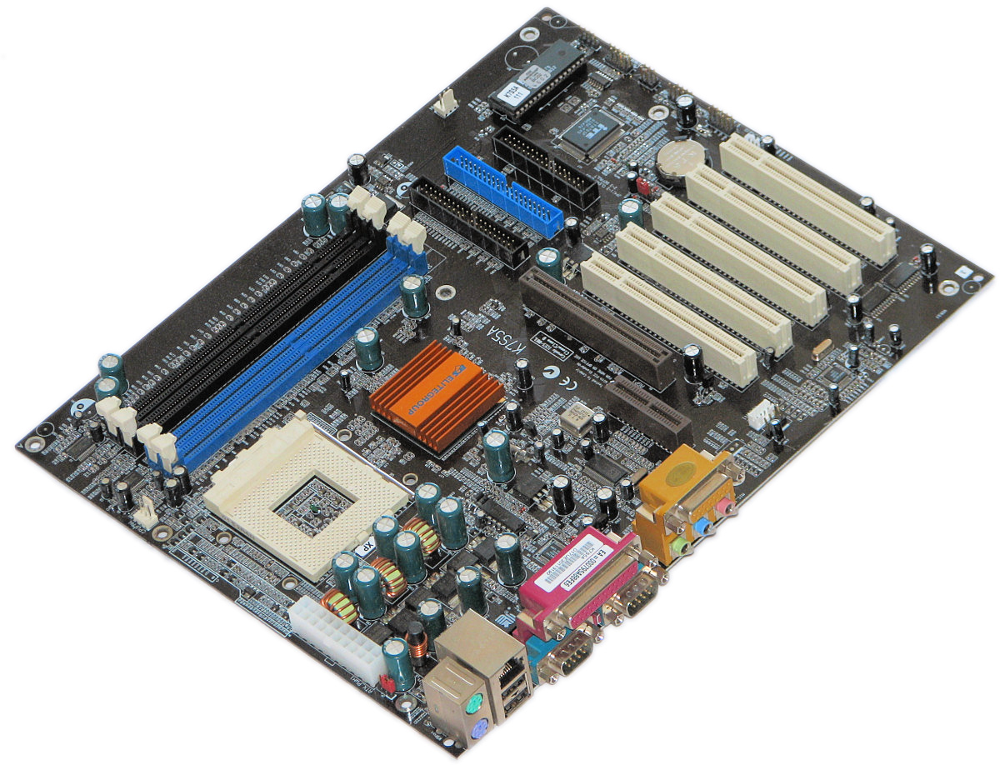

title:  'IT Systeme (IT)'
subtitle: '00-Einführung'
author: Dr. Marcel Tilly
institute: Bachelor Wirtschaftsinformatik, Fakultät für Informatik
...

---
class: title-slide  

# Modul- IT Systeme (IT)
### Bachelor Wirtschaftsinformatik

## 00-Einführung
### Prof. Dr. Marcel Tilly
Fakultät für Informatik, Cloud Computing

---
# Organisatorisches

- Übungen on Github: https://hsro-wif-it.github.io

- Vorlesungstermin: Dienstags, 09:45 - 11:15 B0.15

- Übungen: Dienstags, 3./4./5. Stunde, S0.07; Tutor: Daniel Herzinger

- Übung heute entfällt!
- **Erste Übung am 8.10 bitte in Übungsgruppe eintragen!**

- Kommunikation: via Mattermost (einschreiben)

#### Leistungsnachweis

- schriftliche Prüfung (SP, 90 Minuten) am Ende des Semesters
- Prüfungsanmeldung im OSC

---
# Lernziele

Die Studierenden...
- ... **kennen** Architektur- und Prozessor-Alternativen moderner Computersysteme und **können einschätzen**, wie einzelne Aspekte der Architektur die Leistungsfähigkeit eines Systems beeinflussen kann.
- ... können moderne Betriebssysteme nutzen und diese **effektiv einsetzen**.
- ... **können erklären**, wie wie Daten zwischen Systemen kommuniziert werden und sie sind in der Lage die Funktionsweise paketvermittelnder Systeme **zu erklären**.
- ... **kennen** das Konzept der Protokolle und Schichten und **wissen** einzelne Aufgaben der Datenkommunikation den richtigen Schichten **zuzuordnen**.
- ... **können erläutern**, welche Technologien im lokalen Netzwerk und Internet eingesetzt werden und **können** diese in eigenen Anwendungen **einsetzen**.
- ... **können** die Studierenden die technischen Grundlagen der Internettechnologien **erklären und beurteilen**, welche Auswirkungen und Möglichkeiten diese in Unternehmen haben.

---
# Was heisst das konkret?

Studierende der Wirtschaftsinformatik sollten durchaus in der Lage sein ...

- ... die Komponenten in einem Rechner zu identifizieren
- ... einfache Schaltnetze zu verstehen
- ... den Unterschied zwischen x86 und ARM kennen 
- ... in verschiedenen Betriebssystemen zurecht zu kommen und das nicht nur mit der Maus
- ... zu wissen was IP bedeutet und wie es verwendet wird
- ... die Funktionsweise einer Client/Server-Architektur erklären zu können
- ... Remote Method Invocation (RMI) entfernte Methoden aufzurufen
- ... HTTP zu verwenden und Web-Anwendungen zu entwickeln
- ... die Themen Cloud, Virtualisierung und Docker in den richtigen Kontext zu setzen.

---

# Welche IT Systeme kennen Sie?

---

# IT Systeme?

Auszug aus [https://de.wikipedia.org/wiki/Informationstechnisches_System]() vom 30.9.2019:

"Unter dem Begriff informationstechnisches System (abgekürzt IT-System) versteht man jegliche Art elektronischer datenverarbeitender Systeme. 
Darunter fallen zum Beispiel Computer, Großrechner, Hochleistungsrechner, verteilte Systeme (wie z. B. Serversysteme, Computer-Grids, Cloud Computing), Datenbanksysteme, Informationssysteme, Prozessrechner, Digitale Messsysteme, DSP-Systeme, Mikrocontroller-Systeme, Kompaktregler, eingebettete Systeme, Mobiltelefone, Handhelds, digitale Anrufbeantworter, Videokonferenzsysteme und diverse Kommunikationssysteme u. a. m. All diese Systeme vereinen aktuell den Fakt der Indienstnahme von Von-Neumann-Digitalrechnern in sich."

"Der Begriff wurde am 22. August 2007 in einem Fragenkatalog des deutschen Bundesministeriums der Justiz im Zusammenhang mit Online-Durchsuchungen als Rechtsbegriff verwendet. Das Bundesverfassungsgericht hat im Urteil zur Online-Durchsuchung vom 27. Februar 2008 – 1 BvR 370/07 bzw. 1 BvR 595/07 – auch das **Internet in seiner Gesamtheit als informationstechnisches System angesehen**"

---

# Themen

1.	Grundlagen zu Hardwarekonzepten und Rechnerarchitekturen ( Von-Neumann-Architektur)
2.	Logischer Entwurf von Computern und Schaltnetze
3.	Rechnerstrukturen, Buskonzepte, Rechenwerk, Leitwerk, Speicher, Ein-/Ausgabe
4.	Prozessorarchitektur an Beispielen von x86 und ARM
5.	Betriebssysteme an Beispielen von Windows und Linux
6.	Funktionsweise lokaler Netzwerke
7.	Verteilte Anwendungen
8.	Internettechnologien: Protokolle, Konzepte und Architekturen
9.	Basistechnologien des World Wide Webs (WWW) 
10.	Konzepte und Realisierung von Webanwendungen
11.	Cloud - Architekturen/ -Technologien

---

# Was ist was?

.center[]

.footenote[Intel Sandybridge Xeon taken from https://www.flickr.com/photos/130561288@N04/24949723166]

---

# Was ist das?

.center[]

.footenote[taken from commons.wikimedia.org]

---

# Was ist was?

.center[]

.footenote[taken from commons.wikimedia.org]

---

# Komponenten der Hauptplatine (Mainboard)

- _Prozessor_ 
- _Arbeitsspeicher_: DDR3 (= Double Data Rate), DDR4 SDRAM (= Synchronous Dynamic Random-Access Memory)
- _I/O Geräte_

---

# Komponenten der Hauptplatine (Mainboard)

- _Prozessor_ (CPU): Intel Pentium, Intel Core i3, i5, i7, AMD Ryzen, ...
- _Arbeitsspeicher_: DDR3 (= Double Data Rate), DDR4 SDRAM (= Synchronous Dynamic Random-Access Memory); 4GB - 128GB
- _I/O Geräte_: Grafikkarte, Netzwerkkarte, Soundkarte, Festplatten, Keyboard, Maus

Ausserdem:
- _Northbridge_: koordiniert die Kommunikation zwischen der CPU, dem Arbeitsspeicher, Southbridge und Hochgeschwindigkeits-Schnittstellen (AGP oder PCIe)
- _Southbridge_: koordiniert die Kommunikation zwischen der Northbridge und langsameren Komponenten (PCI-Karten, Laufwerken, BIOS, Keyboard, Maus)
- _BIOS Chip_ : mit integrierter Firmware

---

# Ok, was ist das?

.center[]

.footenote[taken from commons.wikimedia.org]

---

# It's a Pi!

.center[]

.footenote[taken from commons.wikimedia.org]

---
# Der RaspberryPi

- Der Raspberry Pi ist ein **Einplatinencomputer** 
- Entwickelt von der britischen Raspberry Pi Foundation (2012)
- Ein-Ship-System: System on a chip (SoC) 

Spezifikation
- _Prozessor_: ARMv6 oder ARMv8
- _Arbeitsspeicher_: 512MB - 4GB (onBoard)
- _I/O_ : GPIO (=General Purpose Input/Output)

- ausserdem: Betriebssystem via SD Karte

Betriebssysteme
- Linux, Windows, ....

---

# Wie reden die miteinander?

---

# Netzwerk

---

# Internet 

---

# Cloud

---

# Zusammenfassung

