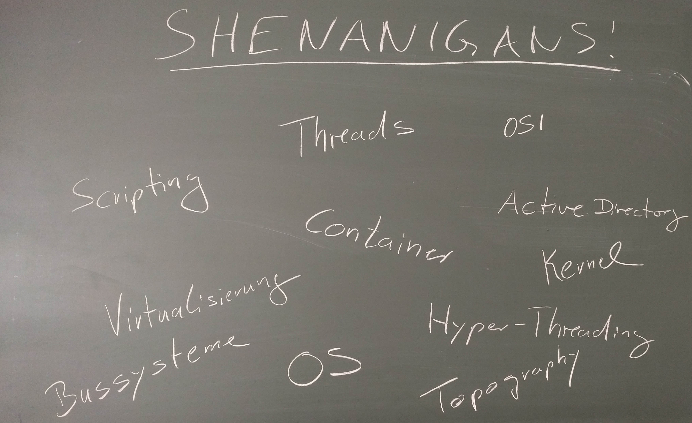
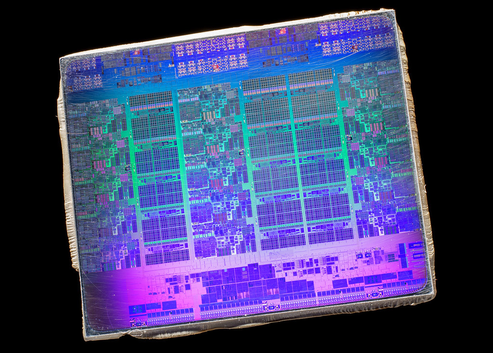
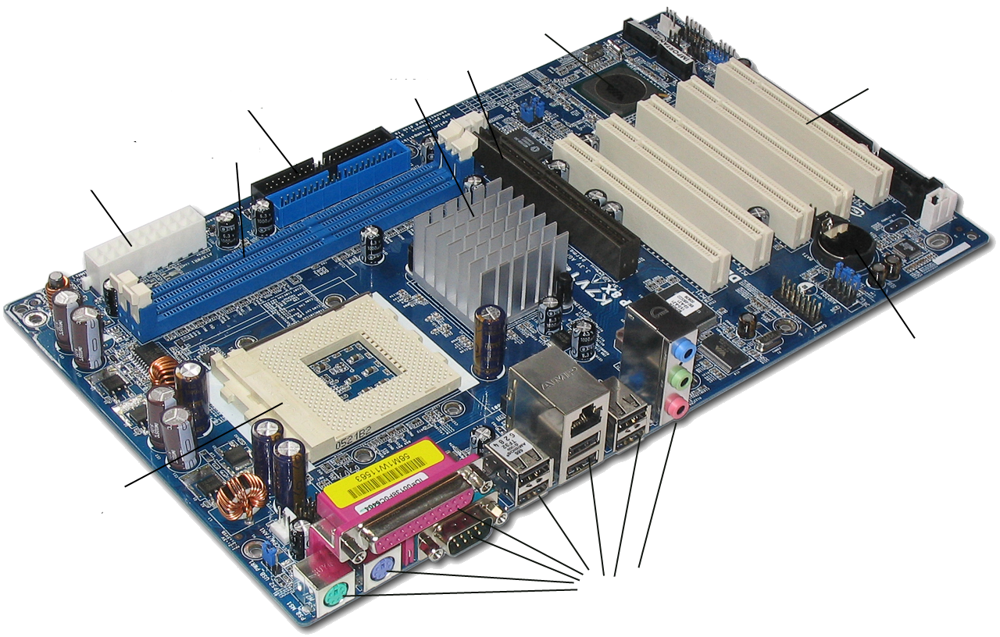
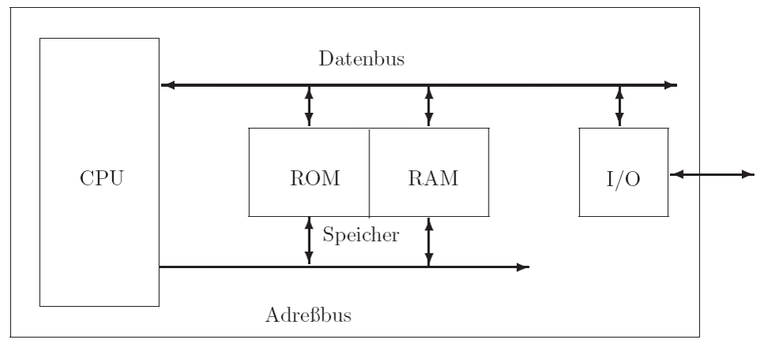
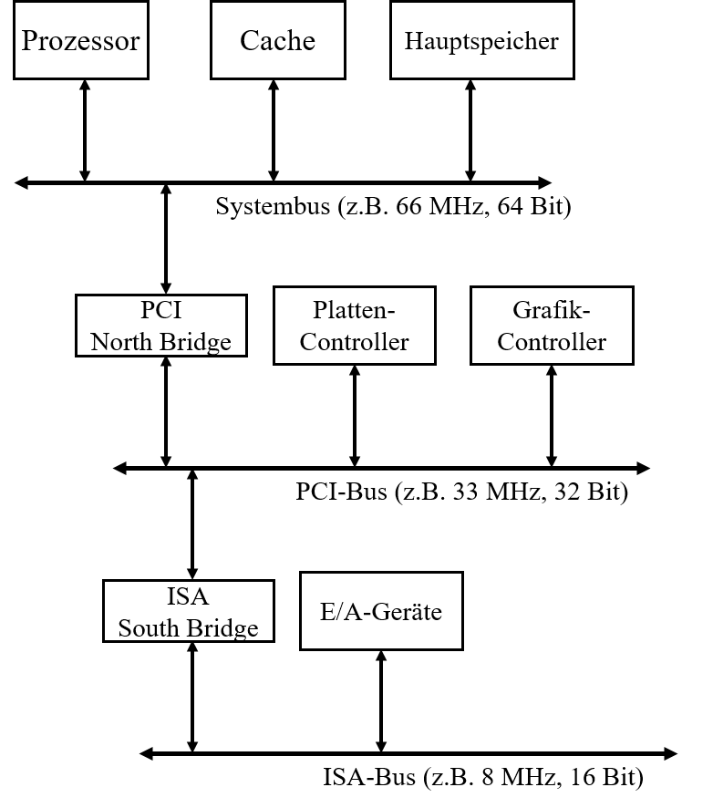
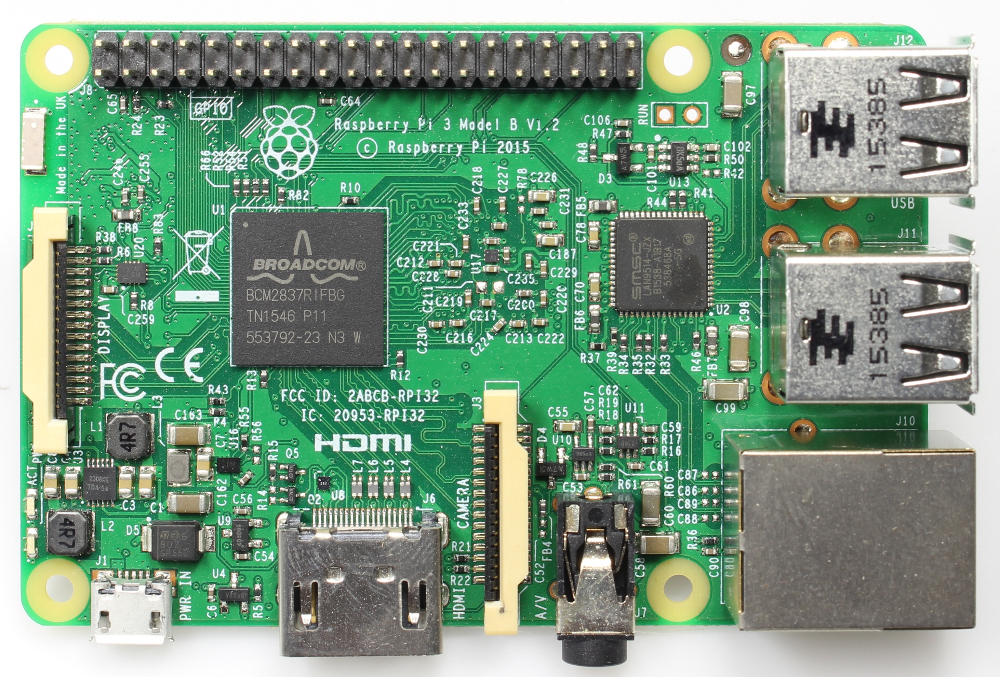
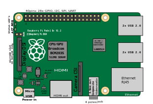
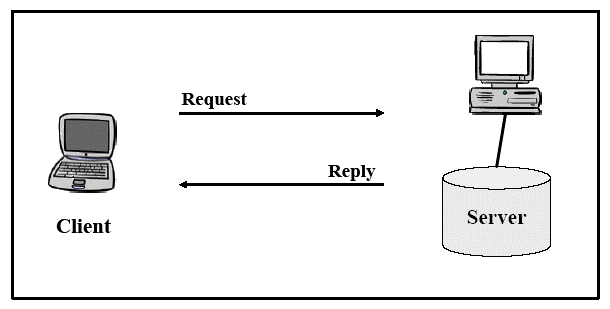
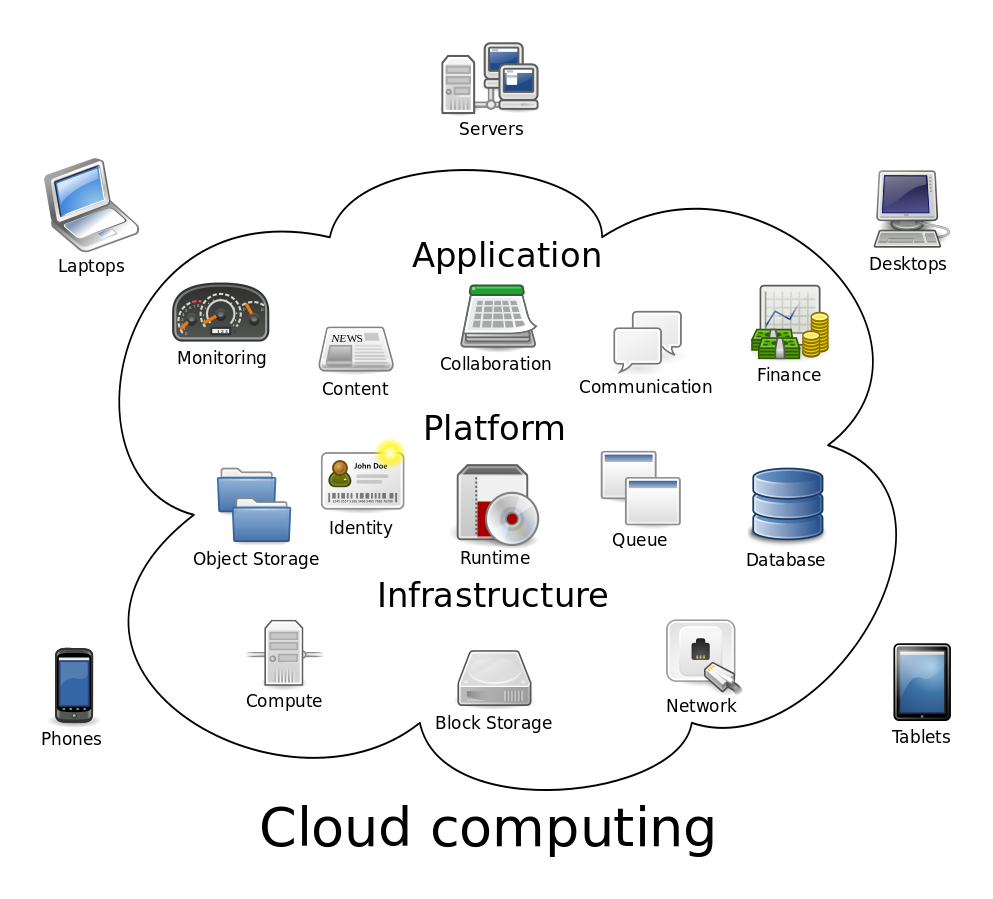

---
title: 'Modul: IT Systeme (IT)'
subtitle: '00-Einführung'
author: 'Dozent: Prof. Dr. Marcel Tilly'
institute: 'Bachelor Wirtschaftsinformatik, Fakultät für Informatik'
...
---
class: title-slide  

# Modul- IT Systeme (IT)
### Bachelor Wirtschaftsinformatik

## 00-Einführung
### Prof. Dr. Marcel Tilly
Fakultät für Informatik, Cloud Computing

---
# Organisatorisches

- Übungen on Github: https://hsro-wif-it.github.io
- Vorlesungstermin: Dienstags, 09:45 - 11:15 B0.15
- Übungen: Dienstags, 3./4./5. Stunde, S0.07; Tutor: Daniel Herzinger
- Übung heute entfällt!
- **Erste Übung am 8.10 bitte in Übungsgruppe eintragen!**
- Kommunikation: via Mattermost (einschreiben)

#### Leistungsnachweis

- schriftliche Prüfung (SP, 90 Minuten) am Ende des Semesters
- Prüfungsanmeldung im OSC

---

# Lernziele

Die Studierenden...

- ... **kennen** Architektur- und Prozessor-Alternativen moderner Computersysteme und **können einschätzen**, wie einzelne Aspekte der Architektur die Leistungsfähigkeit eines Systems beeinflussen kann.
- ... können moderne Betriebssysteme nutzen und diese **effektiv einsetzen**.
- ... **können erklären**, wie wie Daten zwischen Systemen kommuniziert werden und sie sind in der Lage die Funktionsweise paketvermittelnder Systeme **zu erklären**.
- ... **kennen** das Konzept der Protokolle und Schichten und **wissen** einzelne Aufgaben der Datenkommunikation den richtigen Schichten **zuzuordnen**.
- ... **können erläutern**, welche Technologien im lokalen Netzwerk und Internet eingesetzt werden und **können** diese in eigenen Anwendungen **einsetzen**.
- ... **können** die Studierenden die technischen Grundlagen der Internettechnologien **erklären und beurteilen**, welche Auswirkungen und Möglichkeiten diese in Unternehmen haben.

---

# Was heisst das konkret?

Studierende der Wirtschaftsinformatik sollten durchaus in der Lage sein ...

- ... die Komponenten in einem Rechner zu identifizieren
- ... einfache Schaltnetze zu verstehen
- ... den Unterschied zwischen x86 und ARM kennen 
- ... in verschiedenen Betriebssystemen zurecht zu kommen und das nicht nur mit der Maus
- ... zu wissen was IP bedeutet und wie es verwendet wird
- ... die Funktionsweise einer Client/Server-Architektur erklären zu können
- ... Remote Method Invocation (RMI) entfernte Methoden aufzurufen
- ... HTTP zu verwenden und Web-Anwendungen zu entwickeln
- ... die Themen Cloud, Virtualisierung und Docker in den richtigen Kontext zu setzen.

---

# Welche IT Systeme kennen Sie?

Wir sammeln einfach mal alles was uns einfällt und in den Topf _IT Systeme_ passen könnte!

Los geht es!

.center[]

---

# IT Systeme?

Auszug aus [https://de.wikipedia.org/wiki/Informationstechnisches_System]() vom 30.9.2019:

"Unter dem Begriff informationstechnisches System (abgekürzt IT-System) versteht man jegliche Art elektronischer datenverarbeitender Systeme. 
Darunter fallen zum Beispiel Computer, Großrechner, Hochleistungsrechner, verteilte Systeme (wie z. B. Serversysteme, Computer-Grids, Cloud Computing), Datenbanksysteme, Informationssysteme, Prozessrechner, Digitale Messsysteme, DSP-Systeme, Mikrocontroller-Systeme, Kompaktregler, eingebettete Systeme, Mobiltelefone, Handhelds, digitale Anrufbeantworter, Videokonferenzsysteme und diverse Kommunikationssysteme u. a. m. All diese Systeme vereinen aktuell den Fakt der Indienstnahme von Von-Neumann-Digitalrechnern in sich."

"Der Begriff wurde am 22. August 2007 in einem Fragenkatalog des deutschen Bundesministeriums der Justiz im Zusammenhang mit Online-Durchsuchungen als Rechtsbegriff verwendet. Das Bundesverfassungsgericht hat im Urteil zur Online-Durchsuchung vom 27. Februar 2008 – 1 BvR 370/07 bzw. 1 BvR 595/07 – auch das **Internet in seiner Gesamtheit als informationstechnisches System angesehen**"

---

# Themen

1.	Grundlagen zu Hardwarekonzepten und Rechnerarchitekturen ( Von-Neumann-Architektur)
2.	Logischer Entwurf von Computern und Schaltnetze
3.	Rechnerstrukturen, Buskonzepte, Rechenwerk, Leitwerk, Speicher, Ein-/Ausgabe
4.	Prozessorarchitektur an Beispielen von x86 und ARM
5.	Betriebssysteme an Beispielen von Windows und Linux
6.	Funktionsweise lokaler Netzwerke
7.	Verteilte Anwendungen
8.	Internettechnologien: Protokolle, Konzepte und Architekturen
9.	Basistechnologien des World Wide Webs (WWW) 
10.	Konzepte und Realisierung von Webanwendungen
11.	Cloud - Architekturen/ -Technologien

---

# Was ist das?

.center[]

.footenote[Intel Sandybridge Xeon taken from https://www.flickr.com/photos/130561288@N04/24949723166]

---

# Was ist was?

.center[]

.footenote[taken from commons.wikimedia.org]

---

# Was ist was?

.center[]

.footenote[taken from commons.wikimedia.org]

---

# Wie spielt das zusammen?

.center[]

---

# Komponenten der Hauptplatine (Mainboard)

- _Prozessor_ 
- _Arbeitsspeicher_: DDR3 (= Double Data Rate), DDR4 SDRAM (= Synchronous Dynamic Random-Access Memory)
- _I/O Geräte_

---

# Komponenten der Hauptplatine (Mainboard)

- _Prozessor_ (CPU): Intel Pentium, Intel Core i3, i5, i7, AMD Ryzen, ...
- _Arbeitsspeicher_: DDR3 (= Double Data Rate), DDR4 SDRAM (= Synchronous Dynamic Random-Access Memory); 4GB - 128GB
- _I/O Geräte_: Grafikkarte, Netzwerkkarte, Soundkarte, Festplatten, Keyboard, Maus

Ausserdem:

- _Northbridge_: koordiniert die Kommunikation zwischen der CPU, dem Arbeitsspeicher, Southbridge und Hochgeschwindigkeits-Schnittstellen (AGP oder PCIe)
- _Southbridge_: koordiniert die Kommunikation zwischen der Northbridge und langsameren Komponenten (PCI-Karten, Laufwerken, BIOS, Keyboard, Maus)
- _BIOS Chip_ : mit integrierter Firmware

---

# Nortbridge/ Southbridge

.center[]

---

# Ok, was ist das?

.center[]

.footenote[taken from commons.wikimedia.org]

---

# Aufgabe

## Was ist was?

- Bilden sie Gruppen zu dritt
- versuchen Sie in der Gruppe die einzelnen Komponenten (Prozessor, I/O, Speicher) zu identifizieren
- Evtl. müssen sie das Internet benutzen!

.center[]

---

# It's a Pi!

.center[]

.footenote[taken from commons.wikimedia.org]

---

# Der RaspberryPi

- Der Raspberry Pi ist ein **Einplatinencomputer** 
- Entwickelt von der britischen Raspberry Pi Foundation (2012)
- Ein-Ship-System: System on a chip (SoC) 

Spezifikation

- _Prozessor_: ARMv6 oder ARMv8
- _Arbeitsspeicher_: 512MB - 4GB (onBoard)
- _I/O_ : GPIO (=General Purpose Input/Output)

- ausserdem: Betriebssystem via SD Karte

Betriebssysteme

- Linux, Windows, ....

---

# Wie reden die miteinander?

.center[]

**Welche Alternativen gibt es?**

---

# Netzwerk

Ein vernetztes System und die Möglichkeit der Nutzung von

1. Nutzung von gemeinsamen Betriebsmitteln
    - Nutzung der gemeinsamen Hardware
    - Zugriff zu gemeinsamen Daten und Programmen
2. Mailing Dienste: Das Netz bietet die Möglichkeit der Bürokommunikation
3. Anbindung an Großrechner und zentrale Server Dies ermöglicht den Stationen im Netz den
Zugriff auf zentrale Datenbestände und ein Arbeiten auf dem zentralen Rechner.

.center[]

---

# Internet 

- Das Internet ist ein weltweiter Verbund von Rechnernetzwerken. 
- Es ermöglicht die Nutzung von Internetdiensten wie 

**?? Welche Dienste fallen ihnen ein?**

- Dabei kann sich jeder Rechner mit jedem anderen Rechner verbinden. 
- Der Datenaustausch zwischen den über das Internet verbundenen Rechnern erfolgt über die technisch normierten Internetprotokolle.

**?? Welche Protokolle fallen ihnen ein?**

- Die Technik des Internets wird durch die RFCs der Internet Engineering Task Force (IETF) beschrieben. 

---

# Internet 

- Das Internet ist ein weltweiter Verbund von Rechnernetzwerken. 
- Es ermöglicht die Nutzung von Internetdiensten wie 

**WWW, E-Mail, Telnet, SSH, XMPP, MQTT und FTP**

- Dabei kann sich jeder Rechner mit jedem anderen Rechner verbinden. 
- Der Datenaustausch zwischen den über das Internet verbundenen Rechnern erfolgt über die technisch normierten Internetprotokolle.

**HTTP, IP, UDP, TCP, SMTP**

- Die Technik des Internets wird durch die RFCs der Internet Engineering Task Force (IETF) beschrieben. 

---

# Internet - Fun Facts

- An der Suchmaschine Google gibt es kein Vorbeikommen: Jeden Monat kommt die Homepage auf mehr als 42,5 Milliarden Besucher. Das Google-Vergnügen ist allerdings nur kurz: Im Schnitt bleiben Internetnutzer neun Sekunden auf der Webseite.

- Die [allererste Internetseite](http://info.cern.ch/hypertext/WWW/TheProject.html) ist immer noch online.

- Die US-amerikanische Bibliothekarin Jean Armour Polly etablierte 1992 den Begriff „Im Internet surfen“ in einem Magazin-Artikel.

- Den ersten Tweet überhaupt schrieb Twitter-Erfinder Jack Dorsey am 21. März 2006.

- Das erste YouTube-Video lud Gründer Jawed Karim am 23. April 2005 hoch. Das belanglose Stück Netzgeschichte trägt den Titel „Me at the zoo“.

---

# Cloud

## Cloud Computing ...

- ... ist eine IT-Infrastruktur, die beispielsweise über das Internet verfügbar gemacht wird. Sie beinhaltet in der Regel Speicherplatz, Rechenleistung oder Anwendungssoftware als Dienstleistung.

- ... verfolgt den Ansatz, IT-Infrastrukturen über ein Rechnernetz zur Verfügung zu stellen, ohne dass diese auf dem lokalen Rechner installiert sein müssen. 

**Welche Dienste könnten das sein?**

---

# Cloud Services

.center[]

---

# Zusammenfassung

- IT Systeme nicht genau definiert
- Wir schauen uns an:
    - Rechner- und Rechneraufbau
    - Betriebssysteme
    - Netzwerke
    - Verteilte Anwendungen
    - Cloud Systeme

Wow, und das in 15 Vorlesungen! 

Klingt nach Spass :-)

.center[]
