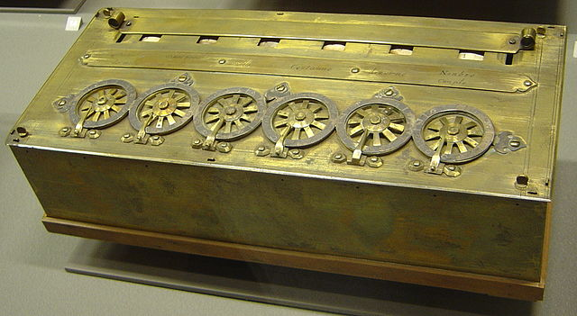
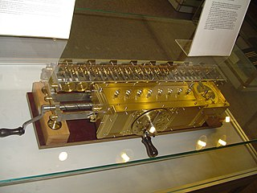
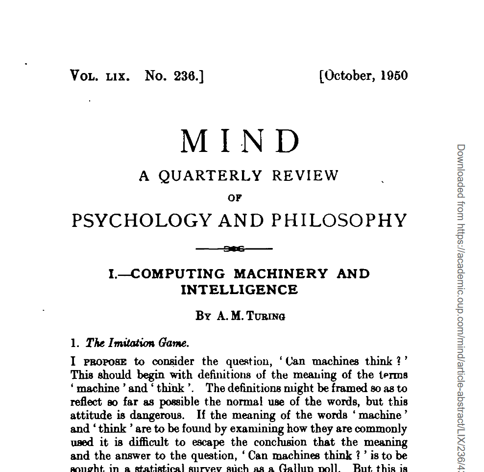
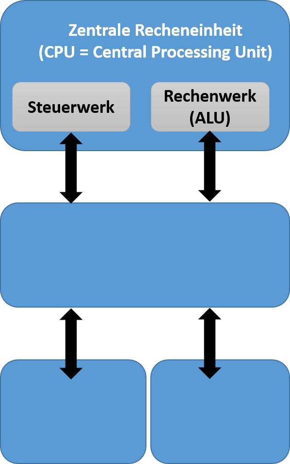
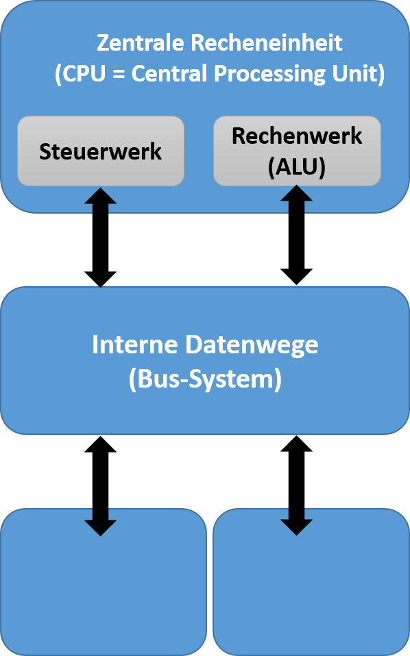
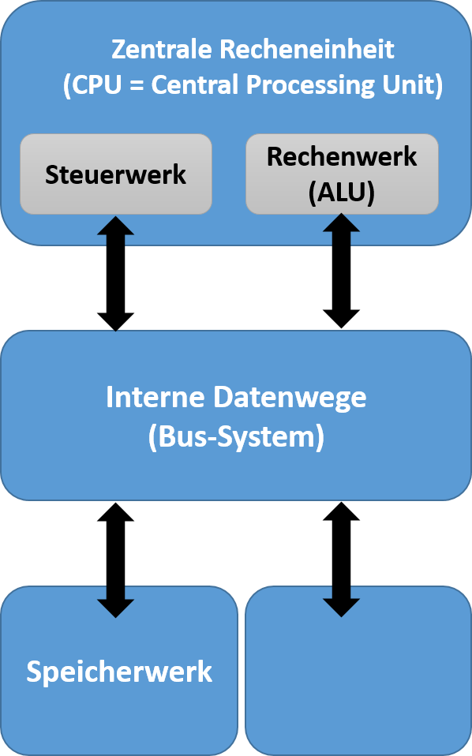
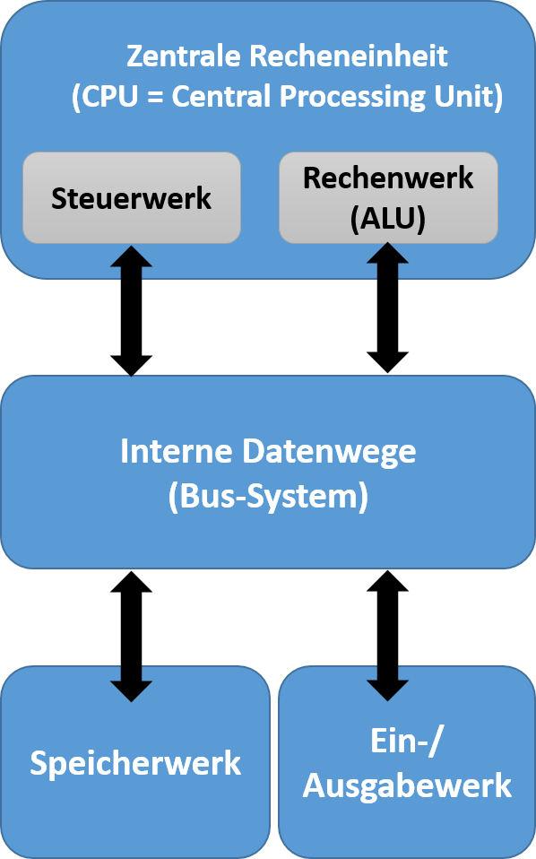
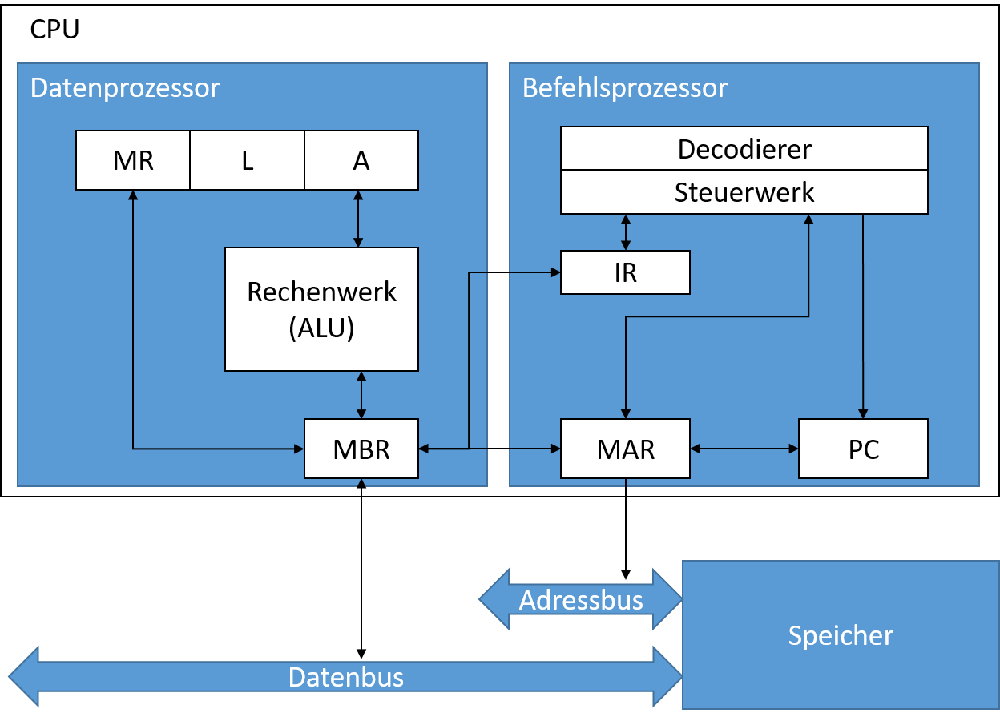
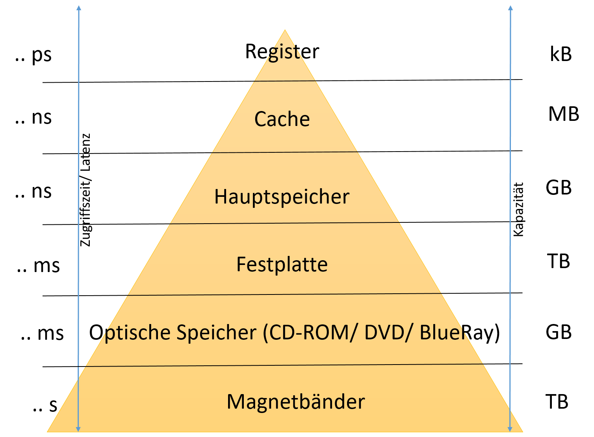
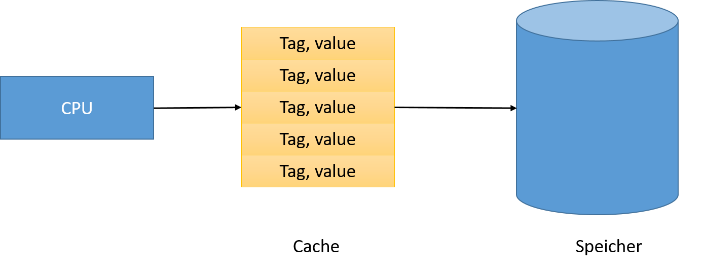

---
title: 'Modul: IT Systeme (IT)'
subtitle: '01-Vorlesung: von-Neumann Rechner'
author: 'Dozent: Prof. Dr. Marcel Tilly'
institute: 'Bachelor Wirtschaftsinformatik, Fakultät für Informatik'
...
---
class: title-slide  

# Modul- IT Systeme (IT)
### Bachelor Wirtschaftsinformatik

## 01-Vorlesung: von-Neumann Rechner
### Prof. Dr. Marcel Tilly
Fakultät für Informatik, Cloud Computing

---

# Agenda

- Geschichte der Rechner/ -Computerentwicklung
- Alan Turing
- ENIAC und von-Neumann
- von-Neumann Architektur
- Prozessoren
- Cache-Strategien

---

class: split-50

# Before we start...

## Logo Competition!!!!

.column[
### Boring logo


]

.column[
### zu gewinnen


]

**Send to me by end of this week! We start logo selection next Monday!**

---

# Lernziele

- Die Studierenden können *grob* die Entwicklungsgeschichte des Computers erklären
- Die Studierenden können die von-Neumann -Architektur skizzieren
- Die Studierenden sind in der Lage Cache-Strategien zu implementieren

---

# Rechner-/ Computerentwicklung

- Abakus, etc. 17. Jahrhundert 

- Blaise Pascal (1623-1662) Rechenmaschine „Pascaline“
    - *machine d`arithmetique*
    - bestand aus Messing, Elfenbein und Holz
    - Addition [Subtraktion über Zweierkomplement]
    - steht im Dresdner Zwinger

.center[]

.footnote[taken from https://de.wikipedia.org/wiki/Pascaline#/media/Datei:Arts_et_Metiers_Pascaline_dsc03869.jpg]
---

# Rechner-/ Computerentwicklung

-  Gottfried Wilhelm Leibniz (1646-1716): Rechenmaschine 
    - Addition / Subtraktion
    - Division / Multiplikation
    - sehr anfällig auf Grund der mechanischen Komplexität

.center[]

.footnote[taken from http://de.wikipedia.org/w/index.php?title=Datei:Leibnitzrechenmaschine.jpg&filetimestamp=20060706122903] 

---

class: split

# Rechner-/ Computerentwicklung

Charles Babbage (1792-1871): Mathematiker und Philosoph

.column[
- Difference Engine / Differenzmaschine (1820)
    - Lösung polynominaler Fkt. 
- Analytical Engine (Entwurf) 
 - Sollte von Dampfmaschine betrieben werden
 - Wäre mehr als 30 Meter lang und 10 Meter breit gewesen 
 - Deutet zahlreiche Innovationen und Konzepte an, u.a.: 
  1. Eingabe (Befehle u. Daten) über Lochkarten - Ausgabe über Lochkartenstanzer
  2. Speicherwerk 
  3. Rechenwerk 
]

.column[
.center[]
]

.footnote[taken from https://de.wikipedia.org/wiki/Charles_Babbage#/media/Datei:AnalyticalMachine_Babbage_London.jpg]

---

# Rechner-/ Computerentwicklung
 
 COLOSSUS (1943) & ENIGMA Lorenz-Schlüsselmaschine

.center[]

.footnote[taken from https://de.wikipedia.org/wiki/Enigma_(Maschine)#/media/Datei:Enigma_(20967055154).jpg]

---

class: split

  # Alan Turing 1912 – 1954 


britischer Logiker, Mathematiker, Kryptoanalytiker und Informatiker

.column[ 
- 1936: On Computable Numbers, with an Application to the “Entscheidungsproblem” 

- Turingmaschine 2. Weltkrieg: „Code Knacker“, u.a. „Turing-Bombe“, „Colossus“

- 1945-1948: National Physical Laboratory: ACE (Automatic Computing Engine), Referenz zu Babbages „Analytical Engine“

- 1948-1949: „Manchester Mark I“, Röhrencomputer 

- 1950: „Computing machinery and intelligence“ 
]

.column[
.center[]
]

---

# Alan Turing

- Das von ihm entwickelte Berechenbarkeitsmodell der Turingmaschine bildet eines der Fundamente der Theoretischen Informatik

- Nach ihm benannt sind der Turing Award, die bedeutendste Auszeichnung in der Informatik

- Turingtest?

---

# Alan Turing

- Das von ihm entwickelte Berechenbarkeitsmodell der Turingmaschine bildet eines der Fundamente der Theoretischen Informatik

- Nach ihm benannt sind der Turing Award, die bedeutendste Auszeichnung in der Informatik

- Turingtest ("*The Imitation Game*"):

.center[]

---

# Aufgabe

## Versuchen sie ihr Glück/ Können

.center[**Bot or not?**]

.center[http://www.botpoet.com]

---

class: split-50

# ENIAC

**Electronic Numerical Integrator and Computer (1942-1946)**

.column[
- Addition/Subtraktion 0,2ms, Multiplikation 2,8ms, eine Division 24ms und eine Quadratwurzel > 300ms. 
- Die komplette Anlage beanspruchte eine Fläche von 10 m × 17 m und wog 27 Tonnen. 
- Er bestand aus 17.468 Elektronenröhren, 7.200 Dioden, 1.500 Relais, 70.000 Widerständen und 10.000 Kondensatoren.
- Der ENIAC wurde programmiert, indem man die einzelnen Komponenten mit Kabeln verband und die gewünschten Operationen auf Drehschaltern einstellte
]

.column[
.right[]
]

---

# John von Neumann

* 1903 (Budapest) als János von Neumann zu Margitta, † 1957 (Washington D.C.)

-  U.a. Arbeiten zur Quantenmechanik, Spieltheorie, Manhattan-Projekt (mit Oppenheimer) 

- Informatik: Von-Neumann-Architektur bzw. VonNeumann-Rechner: Rechner, in dem Daten und Programm binär codiert in einem Speicher liegen

- Universalrechner: Struktur des Rechners ist unabhängig Universalrechner von dem zu lösenden Problem, d.h. keine starre Programmierung des Rechners über hardwareseitige Repräsentation (z.B. Kabelverbindungen bei ENIAC) des Programmes.

---

# Die von-Neuman Ideen

- John von Neumann beschrieb erstmals 1945 in seinem "First Draft of a Report on the EDVAC" das Konzept, wonach Computerprogramme und die zu verarbeitenden Daten zusammen im gleichen Speicher abgelegt werden können. 
- Die meisten heute verwendeten Einzelplatzcomputerbasieren auf diesem Modell.
- Damals war es revolutionär, da die zuvor üblichen Rechenmaschinen fest für bestimmte Zwecke gebaut wurden oder nur per Lochkarten oder Lochstreifen neue Programme einlesen konnten. 
- Nun war es jedoch möglich, verschiedene Programme unter derselben Hardwarearchitektur ablaufen zu lassen. 
- Es ist interessant, dass wenige Jahre zuvoreinige der Ideen des Konzepts bereits von Konrad Zuse beschrieben und teilweise bereits 1938 in der Z1 realisiert worden waren.

---

class: split-50

# Von-Neumann-Architektur 

.column[
- Steuerwerk
- Recheneinheit

Funktionsweise & Eigenschaften:
- Zahlen werden im Rechner binär dargestellt 
- Programme und Daten werden in einem gemeinsamen Speicher abgelegt 
- Befehle geben nur die Speicheradresse an, wo die Daten abgelegt sind, nicht die Daten selbst 
]

.column[
.center[]
]

---

class: split-50

# Von-Neumann-Architektur 

.column[
- Steuerwerk
- Recheneinheit
- interne Datenwege

Funktionsweise & Eigenschaften:
- Zahlen werden im Rechner binär dargestellt 
- Programme und Daten werden in einem gemeinsamen Speicher abgelegt 
- Befehle geben nur die Speicheradresse an, wo die Daten abgelegt sind, nicht die Daten selbst 
]

.column[
.center[]
]

---

class: split-50

# Von-Neumann-Architektur 

.column[
- Steuerwerk
- Recheneinheit
- interne Datenwege
- Arbeitsspeicher/ Speicherwerk

Funktionsweise & Eigenschaften:
- Zahlen werden im Rechner binär dargestellt 
- Programme und Daten werden in einem gemeinsamen Speicher abgelegt 
- Befehle geben nur die Speicheradresse an, wo die Daten abgelegt sind, nicht die Daten selbst 
]

.column[
.center[]
]

---

class: split-50

# Von-Neumann-Architektur 

.column[
- Steuerwerk
- Recheneinheit
- interne Datenwege
- Arbeitsspeicher/ Speicherwerk
- Ein-/ Ausgabewerks

Funktionsweise & Eigenschaften:
- Zahlen werden im Rechner binär dargestellt 
- Programme und Daten werden in einem gemeinsamen Speicher abgelegt 
- Befehle geben nur die Speicheradresse an, wo die Daten abgelegt sind, nicht die Daten selbst 
]

.column[
.center[]
]

---

class: split

# Die fünf Funktionseinheiten

.column[
- Die ALU (Arithmetic Logic Unit, **Rechenwerk**): Es führt Rechenoperationen und logische Berechnungen durch.
- Die Control Unit (**Steuerwerk**): Dieses interpretiert die Anweisungeneines Programms und steuert die Befehlsabfolge.
- Memory (**Speicherwerk**): Speichert Programme und Daten, die vom Rechenwerkgenutzt werden.
- Das Ein- und Ausgabewerk: Es steuert die Ein- und Ausgabe von Daten und Programmenzwischen dem Rechner und anderen Schnittstellen, wie z.B. dem Benutzer.
- Das **Bus-System**: Es verbindet die Komponenten des Rechners miteinander.
]

.column[
.center[]
]

---

# v.-Neumann-Prinzipien

- der Rechner besteht aus 5 Einheiten: 
 - Steuerwerk, Rechenwerk, Speicher, Ein- und  Ausgabewerk
- Struktur des Rechners ist unabhänig vom zu lösenden Problem
- Programm und Daten werden im gleichen Speicher abgelegt
- Speicher sind in gleichgroße Zellen unterteilt, die fortlaufend nummeriert sind 
- aufeinander folgende Befehle eines Programms werden in aufeinander folgenden Speicherzellen abgelegt
- durch Sprungbefehle kann von der sequentiellen Bearbeitung abgewichen werden

- Es existiert ein Befehlssatz
 – arithmetische Befehle
 – logische Befehle
 – Transportbefehle
 – Verzweigungsbefehle
 – sonstige Befehle
- alle Daten werden binär kodiert
---

# Der Prozessor

- Central Processing Unit (CPU) 
- Ein Programm muss sich im Hauptspeicher befinden, um von der CPU ausgeführt zu werden
- Der Prozessor ruft die Befehle (Instruktionen) des Programms ab, prüft sie und führt sie nacheinander aus.
- Besteht aus:
    - Datenprozessor
    - Befehlsprozessor

.center[]

---

class: split-50

# Der Prozessor

## Datenprozessor

Ist zuständig für das klassische Verarbeiten von Daten und die Ausführung von Berechnungen

.column[
- ein Rechenwerk, die sogenannante ALU
- und (mindestens) drei Speicherplätze (Register): 
  - Akkumulator (A)
  - Multiplikationsregister (MR)
  - Link-Register (R)
- evtl. das Memory Buffer Register (MBR) für die Kommunikation mit dem Speicher
]

.column[
.center[]
]

---

class: split-50

# Der Prozessor

## Befehlsprozessor

Der Befehlsprozessor entschlüsselt Befehle und steuert deren Ausführung

.column[
- der aktuelle Befehle befindet sich im Befehlsregister (IR)
- *MAR* (Memory Address Register) enthält die Adresse des nächsten Speicherplatzes
- *PC* (Program Counter) enthält nächsten auszuführenden Befehl
 - Entschlüsselung erfolgt durch Befehlscodierer
 - die Steuerung der Ausführung durch das Steuerwerk
]

.column[
.center[]
]

---

# Arbeitsweise CPU

Arbeitsweise einer CPU im von-Neumann-Modell:

- Zu jedem Zeitpunkt führt die CPU genau einen Befehl aus. Dieser Befehl kann nur genau einen Datenwert bearbeiten. Dieser Aufbau wird auch als **single instruction, single data (SISD)** bezeichnet
- Die Struktur des Rechners ist unabhängig vom zu lösenden Problem. Programme müssen im Speicher abgelegt werden.
- Für Daten, Programme und Resultate wird derselbe Speicher genutzt. Dadurch können alle Daten im Speicher sowohl als Programme als auch als Eingabedaten interpretiert werden.
- Der Speicher ist eindimensional in fortlaufenden Zellen adressiert.
- Aufeinanderfolgende Programmbefehle folgen auch im Speicher aufeinander.
- Von der eigentlichen Programmfolge kann durch Sprungbefehle abgewichen werden.
- Daten werden grundsätzlich binär kodiert.
- Es existiert eine Reihe von Standardfunktionen für arithmetische, logische und Transportbefehle und bedingte Sprünge

---

# Befehlszyklus (von-Neumann Zyklus)

.left-column[
1. **Fetch**: Der Inhalt des *PC* wird in das *MAR* geladen und der Inhalt dieser Adresse aus dem Speicher über das *MBR* in das *IR* geholt.
2. **Decode**: Der Decodierer erkennt, um welchen Befehl es sich handelt. 
3. **Fetch Operands**: Operanden holen, die durch den Befehle verändert werden sollen.
4. **Execute**: Das Rechenwerk führt die Operation aus
5. **Update Program Counter (UPC)**: Erhöhung des Befehlszählers, damit der Rechner weiß, an welcher Stell des Programms er sich gerade befindet
]

.right-column[
```
MAR := PC;      
MBR := S[MAR];  
IR  := MBR;
decodiere(IR);
IF NOT Sprungbefehl THEN
BEGIN
    <stelle Operanden bereit>;
    PC := PC + 1;
ELSE
    PC := <Sprunzieladresse>;
END
```
]

---
# von Neumann Architektur

## Vorteile

- Bedeutende Idee: Zunächst Laden des Programms und der Daten in ein und denselben Speicher, danach Ausführung.
 - Vor von Neumann: War der Ansatz, dass das Programm hardwareseitig verschaltet wird oder über Lochstriefenkarten schrittweise eingelesen und sofort verarbeitet wurde
 - Nach von Neumann: Sprünge auf vorhergehende und spätere Programmsequenzen
 - Modifikation des Programmcodes während des Programmablaufes

- Paradigmenwechsel: Übergang vom starren Programmablauf zur flexiblen Programmsteuerung bzw. von der *Rechenmaschine* zur *Datenverarbeitungsmaschine*

---

# von Neumann Architektur

## Nachteile

- Da Daten und Befehle im Speicher gehalten werden wird die Verbindung und Datenübertragung zwischen CPU und Speicher über den Systembus zum **von-Neumann-Flaschenhals**

 - Jeglicher Datenverkehr von und zur CPU wird über den internen Bus abgewickelt, dessen Transfergeschwindigkeit langsamer ist, als die Verarbeitungsgeschwindigkeit der CPU.

Welcher Ansatz könnte hier helfen?

---

# von Neumann Architektur

## Nachteile

- Da Daten und Befehle im Speicher gehalten werden wird die Verbindung und Datenübertragung zwischen CPU und Speicher über den Systembus zum **von-Neumann-Flaschenhals**

 - Jeglicher Datenverkehr von und zur CPU wird über den internen Bus abgewickelt, dessen Transfergeschwindigkeit langsamer ist, als die Verarbeitungsgeschwindigkeit der CPU.

 - Dieses Problem versucht man in modernen PC's durch die Verwendung von schnellen Cache-Speichern abzuschwächen. Dieser ist meist in der CPU integriert.

---

# Speicherhierarchie

Größenordnung von Kapazitäten und Zugriffzeiten

.center[]

---

# CPU-Cache

Grundidee des **Caches**: Häufig gebrauchte Speicherworte/ Daten sollten im Cache stehen, um das Problem des von-Neumann-Flaschenhalses zu mindern.

Funktionsprinzip des Cache:

- Die CPU fordert ein gesuchtes Datum oder eine gesuchte Instruktion im Cache an.
- Bei einem **Cache-Hit** befindet sich das Datum/Instruktion im Cache.
- Bei einem **Cache-Miss** wird ein bestimmter Bereich, der das gesuchte Datum enthält, aus dem Hauptspeicher in den Cache geladen.
- **Write-Policies**: *Write-Through* und *Write-Back*

.center[]
---

# Austauschverfahren

Überschreiben/ Ersetzen von Einträgen im Cache:

- *Random*- bzw. *Zufallsverfahren*: Belegung des *Caches* möglichst uniform
 - Ein zufällig ausgewählter Eintrag wird überschrieben
- First in, first out (FIFO) 
 - Ältester Block wird ersetzt (auch wenn gerade benutzt)
- NRU (*not recently used*)
 - Einteilung in 4 Klassen mittels *used* und *modified* bit
    1. Nicht benutzte, nicht modifizierte Einträge 
    1. Nicht benutzte, modifizierte Einträge
    1. Benutzte, nicht modifizierte Einträge
    1. Benutzte, modifizierte Einträge
 - Überschrieben wird ein zufällig ausgewählter Eintrag der niedrigsten Klasse, die nicht leer ist
- LRU (*least recently used*)
 - Der am längsten nicht benutzte Block wird ersetzt

---

# Austauschverfahren

- Clock
 - Alle Cache-Einträge sind gedanklich im Kreis auf einem Ziffernblatt angeordnet, ein Zeiger wird „im Uhrzeigersinn“ weiterbewegt und zeigt den zu ersetzenden Eintrag an.
 - Jeder Cache-Eintrag hat ein used bit, das automatisch durch die Cache-Hardware auf ‚1‘ gesetzt wird, wann immer auf den Eintrag zugegriffen wird.
 - Das Clock-Verfahren sucht nach Eintrag mit used bit = ‚0‘ bei gleichzeitigem Rücksetzen des Bits.

---

# Clock-Algorithmus

Wird auf einen Eintrag zugegriffen, der bereits im Cache enthalten ist (*Cache Hit*), wird *used bit* des gefundenen Eintrags auf ‚1‘ gesetzt, und der („Uhr-“) Zeiger p wird nicht verändert.

sonst:
1. Zeigt Zeiger p auf Eintrag mit used bit = ‚1‘?
1. Falls ja: Setze used bit des Eintrags p auf ‚0‘; bewege Zeiger um eine Position im Uhrzeigersinn weiter (p=p+1); gehe zu 1)
1. Falls nein: Bewege Zeiger um eine Position im Uhrzeigersinn weiter (p=p+1); gebe alten Zeigerwert p-1 als zu ersetzenden Eintrag zurück

---

# Zusammenfassung

- sehr kurze Geschichte zur Computerentwicklung
- von-Neumann Prinzipien
- von-Neumann Architektur
- Prozessor
- Speicher und Caches


